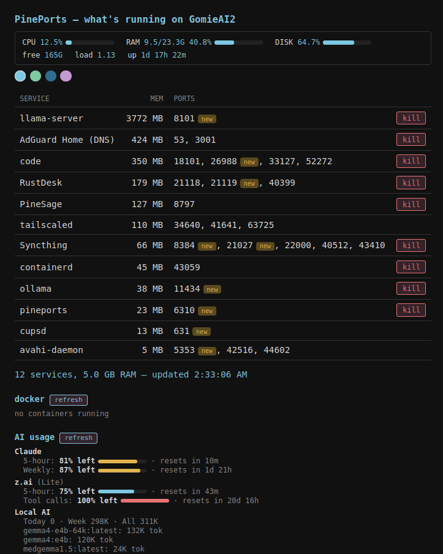

# PinePort

Listener overview for the box it runs on — what's running, on which ports, how much RAM it's eating — plus one-keystroke kills. Runs on **Linux and Windows**. Née `ports`, renamed `pineports`.



## What it does

- `pineports` — CLI table: name, RSS, ports, sorted by memory (one row per pid)
- `pineports kill <port>` — SIGTERM. Docker-published ports stop the container; root-owned pids use passwordless `sudo kill` (sudoers rule `/etc/sudoers.d/ports`: only `/usr/bin/ss -tulpn` and `/usr/bin/kill`, NOPASSWD)
- `pineports --web` — web UI on `:6310` (systemd user service `pineports`, enabled)
  - Reachable LAN-wide and via Tailscale at `http://<hostname>:6310`; the page and login screen show the machine's hostname
  - Ports reachable off-box (TCP, not loopback-bound) are clickable links; hover a service name for its pid + command line
  - Kill buttons hidden for system services (cupsd, avahi, tailscaled, AdGuardHome, systemd)
  - Stats bar: CPU/RAM/disk % with meters, load, uptime — read from `/proc` per poll, no daemons
  - Theme picker: midnight/forest/paper/plum/nord/gruvbox/dracula/solarized/phosphor/amber/contrast, plus four animated themes: Retro (CRT monitor), Departures (split-flap airport board; changed values flip, new ports show BOARDING), Wasteland (rusted riveted plate with falling ash and a flickering generator; new ports glow as SIGNAL) and Tetromino (8-bit Tetris well with a pixel font; each row gets a piece, new services drop in, a stopped one flashes and clears like a line, kill reads DROP, new ports NEXT). Saved in localStorage `pp_theme`
  - Add-on system: `_find_addons()` probes PATH at startup (`shutil.which`); found tool → card + `/api/addon/<name>` route, absent → quietly skipped. Contract: CLI prints JSON, supports `--cached` (fast, no network) and bare invocation (live, own cooldowns). Registry in `ADDONS` dict; renderers in `CARD_RENDER` (generic JSON dump fallback). First add-on: [Needle](https://github.com/KGthePM/Needle) (AI usage gauge). Second: `pineports-docker` (real container CPU/RAM via `docker stats --no-stream`).
  - New-listener badge: ports first seen < 24h ago get a `new` badge — labeled ports and ephemeral ports (≥ 32768, VS Code/Firefox) are exempt. History in `~/.config/pineports-seen.json`.

## Install

```bash
git clone https://github.com/KGthePM/PinePort.git && cd PinePort && ./install.sh
```

The installer copies `pineports`, `pineports-docker` and the `ports` alias to `~/.local/bin`, asks for a dashboard PIN (stored as a sha256 hash, `chmod 600`), and enables the `pineports` systemd user service with linger, so the dashboard starts at boot and keeps running while you're logged out.

```bash
./install.sh               # re-run any time to update; keeps your PIN and labels
./install.sh --reset-pin   # choose a new PIN
./install.sh --uninstall   # remove it (asks before deleting config or turning off linger)
pineports-uninstall        # same, from anywhere (no repo clone needed)
```

Optional: `pip install --user setproctitle` (nicer process name).

Optional sudoers rule for killing root-owned pids (deliberately narrow):

```
kg ALL=(root) NOPASSWD: /usr/bin/ss -tulpn, /usr/bin/kill
```

## Windows

Same tool, same web UI, same CLI. Requires **Python 3.8+**; data comes from
built-in PowerShell (`Get-NetTCPConnection`) plus [psutil](https://pypi.org/project/psutil/)
for process names/RAM and the stats bar:

```powershell
git clone https://github.com/KGthePM/PinePort.git; cd PinePort
python -m pip install psutil
.\start-pineports.cmd      # prompt for a PIN if needed, start, open dashboard
.\restart-pineports.cmd    # reload PinePort and newly installed add-ons
.\stop-pineports.cmd
.\test-pineports.cmd       # cross-platform + real-Windows test suites
```

- The CMD launchers are double-clickable. Their shared PowerShell implementation
  is `windows\pineports.ps1`. Runtime PID and logs are stored under
  `%APPDATA%\pineports\`. If several Python installations are available, the
  launcher selects one with `psutil`; if none has it, the launcher prints the
  exact install command instead of starting with an empty stats bar.
- Manual commands remain available: `python pineports`,
  `python pineports --set-pin`, `python pineports kill <port>`, and
  `python pineports --web`.
- **Run at startup (optional):** press `Win+R`, type `shell:startup`, and put a
  shortcut to `pythonw.exe "<path>\pineports" --web` in that folder.
- **Full-kill parity:** your own processes die with one click. Killing another
  user's process needs an elevated console (`Run as administrator`) — the UI
  tells you when that's the case.
- **Docker Desktop:** published ports stop the container, same as Linux.
- **Config:** `%APPDATA%\pineports\` — same filenames as Linux
  (`pineports-pin`, `pineports-labels.conf`, `pineports-seen.json`).
- **No psutil?** A manual launch still lists ports + pids; install psutil for
  names, RAM, kills, and the stats bar.
- **AI usage:** install [Needle](https://github.com/KGthePM/Needle). PinePort
  discovers `needle` on PATH and the standard
  `%LOCALAPPDATA%\Needle\bin\needle.py` installation. Restart PinePort after
  installing Needle so the AI usage card is registered.

### Windows smoke-test checklist (first run on a new machine)

1. `test-pineports.cmd` — all tests pass
2. `python pineports` — table lists listeners with names + RAM
3. `python pineports --web` → log in with your PIN → services + stats bar render
4. Kill a test server you started yourself (the smoke test does this too)
5. Kill a Docker-published port → container stops
6. (Optional, if in a startup shortcut) reboot → dashboard is up without login


## Notes

- Threaded server (`ThreadingHTTPServer`) — a slow live add-on call (~seconds) no longer blocks the 5s table poll.
- Sessions in-memory (restart = re-login), 30-day `SameSite=Lax` cookie, 1s delay on wrong PIN, global 5-minute lockout after 5 wrong PINs. All endpoints gated, incl. `/api/services`.
- Friendly port labels live in `~/.config/pineports-labels.conf` (`<port>: <label>`).
- Docker services show tiny RSS (only the ipv4/ipv6 proxy is visible) — `docker stats --no-stream` for real usage.
- `code`/`firefox-bin` entries = VS Code/Firefox on random high ports. Normal.
